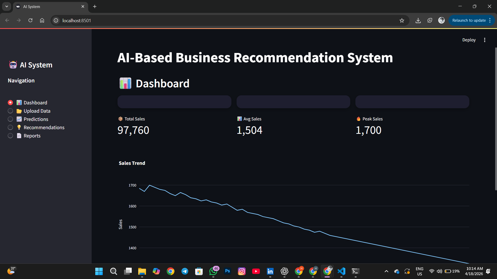
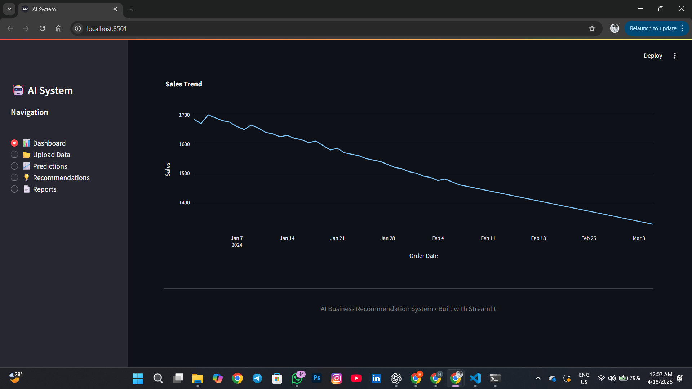
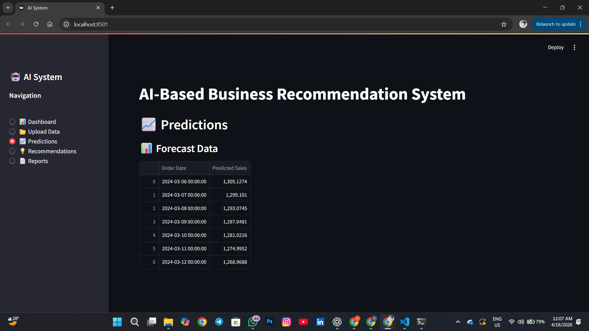
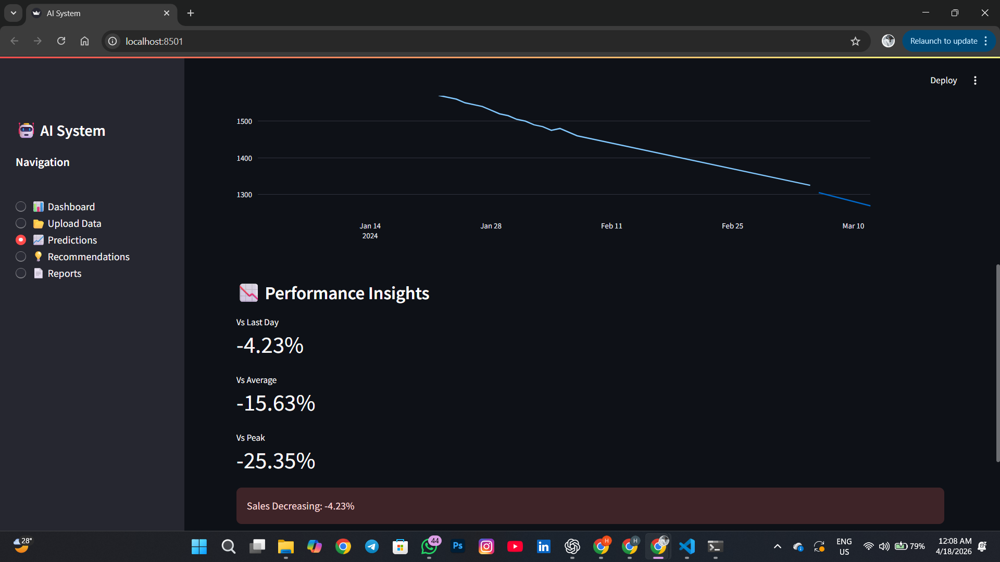
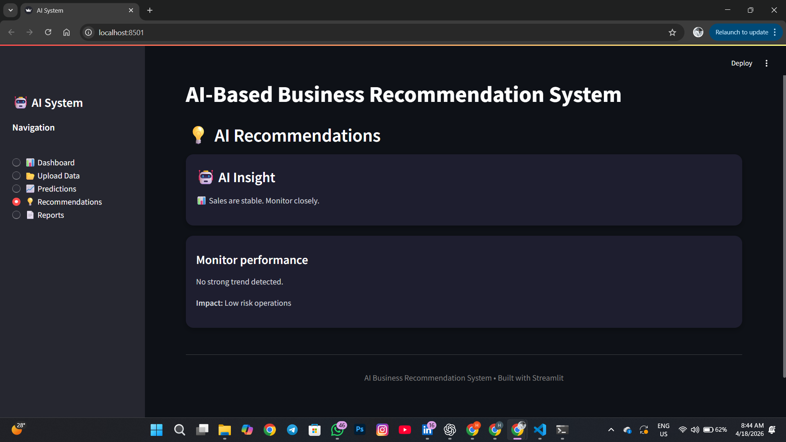

# AI-Based Business Recommendation System

## 📌 Overview
This project is an AI-powered system that analyzes historical sales data, predicts future trends, and generates actionable business recommendations.

## 🚀 Features
- 📊 Sales trend analysis
- 🤖 Machine learning-based predictions
- 💡 AI-generated business recommendations
- 📈 Interactive dashboard using Streamlit
- 📉 Data visualization with Plotly

## 🛠️ Technologies Used
- Python
- Pandas
- NumPy
- Scikit-learn
- Streamlit
- Plotly

## 📂 Project Structure
app.py  
utils/  
  ├── preprocessing.py  
  ├── prediction.py  
  ├── recommendation.py  
sample_data.csv  
requirements.txt  

## ▶️ How to Run

1. Navigate to the project folder:
cd ai-business-recommendation-system

2. Install dependencies:
pip install -r requirements.txt

3. Run the app:
streamlit run app.py

## 📊 Sample Output
- Sales predictions for next 7 days  
- Performance metrics  
- AI-based recommendations

## 📸 Screenshots

### 📊 Dashboard

### 📈 Predictions

### 💡 Recommendations

## 🎯 Purpose
This system helps businesses make data-driven decisions by predicting future sales trends and suggesting strategic actions.

---

## 👨‍💻 Author
Heshan Premathilaka
